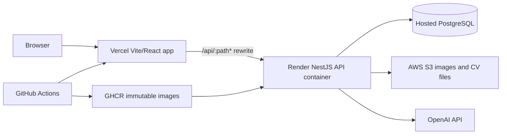

# Production Deployment

AntinOS production is split across hosted services:



The NestJS API is not deployed to Vercel. The frontend is not deployed as a
Render Static Site. The web Docker image is still published to GHCR for Docker
Compose and future self-hosting.

## Vercel Frontend

Vercel deploys `apps/web` from the repository root using `vercel.json`.

Required Vercel production configuration:

```text
Framework:       Vite
Build command:   VITE_API_BASE_URL=/api pnpm --filter web build
Output folder:   apps/web/dist
Install command: pnpm install --frozen-lockfile
```

Set these Vercel environment values:

```bash
VITE_API_BASE_URL=/api
RENDER_API_ORIGIN=https://<render-api-service>.onrender.com
```

`RENDER_API_ORIGIN` is the public Render service origin only. Do not put
database URLs, AWS credentials, OpenAI keys, session secrets, admin password
hashes, or Render deploy hooks in Vercel. Do not create `VITE_*` variables for
server secrets.

`vercel.json` handles:

```text
/api/:path*  ->  $RENDER_API_ORIGIN/:path*
/:path*      ->  /index.html
```

The second rewrite is the React Router SPA fallback, so routes such as
`/admin/profile`, `/admin/projects`, and `/projects/:slug` load directly.

Vercel preview deployments are created for pull requests that change the
frontend or its shared workspace dependencies.

## Render API

Render runs the immutable GHCR API image:

```bash
ghcr.io/<owner>/antin-os-api:<commit-sha>
```

Do not deploy using only `latest` or `master`.

Render owns all server-side runtime configuration:

```bash
NODE_ENV=production
PORT=3001
DATABASE_URL=<postgres-url>
CORS_ORIGIN=<allowed-web-origins>
TRUST_PROXY=true
ADMIN_USERNAME=<owner-username>
ADMIN_PASSWORD_HASH=<password-hash>
AUTH_SESSION_SECRET=<session-secret>
AUTH_SESSION_TTL_SECONDS=86400
AUTH_COOKIE_SECURE=true
AUTH_LOGIN_RATE_LIMIT_MAX=5
AUTH_LOGIN_RATE_LIMIT_WINDOW_SECONDS=300
```

Storage and résumé upload:

```bash
AWS_REGION=<region>
AWS_S3_BUCKET=<bucket>
AWS_ACCESS_KEY_ID=<runtime-secret-or-iam-role>
AWS_SECRET_ACCESS_KEY=<runtime-secret-or-iam-role>
AWS_S3_PUBLIC_BASE_URL=<public-image-base-url>
AWS_S3_PRESIGNED_URL_TTL_SECONDS=900
RESUME_MAX_UPLOAD_BYTES=5242880
```

AI drafting:

```bash
AI_DRAFTING_ENABLED=false
AI_PROVIDER=mock
OPENAI_API_KEY=
OPENAI_MODEL=
AI_DRAFT_TIMEOUT_MS=30000
AI_DRAFT_RATE_LIMIT=5/60
AI_DRAFT_USAGE_LIMIT=25/86400
AI_DRAFT_MAX_INPUT_CHARACTERS=60000
AI_DRAFT_MAX_NOTES_LENGTH=2000
AI_DRAFT_MAX_OUTPUT_TOKENS=1200
```

Only set `AI_PROVIDER=openai` when `OPENAI_API_KEY` and `OPENAI_MODEL` are
configured. Keep OpenAI and AWS credentials API-only.
Deploy and smoke-test with `AI_PROVIDER=mock` before intentionally enabling the
real provider. Case-study and job-assistant generation share one in-memory
rate/usage budget per API instance; horizontally scaled deployments need a
shared limiter for global enforcement. Job descriptions and assistant results
are private, and generated review state is not persisted.

Render should enable proxy-aware production cookies:

```bash
TRUST_PROXY=true
AUTH_COOKIE_SECURE=true
```

Authentication is called from the browser through Vercel `/api`, so the browser
stores the API session cookie against the Vercel frontend origin. The API cookie
uses `HttpOnly`, `SameSite=Lax`, `Secure` in production, and `Path=/`.

Set `CORS_ORIGIN` to include the Vercel production origin and any preview or
custom domains that should call the API directly:

```bash
CORS_ORIGIN=https://<vercel-production-domain>,https://www.example.com
```

Same-origin `/api` calls through Vercel do not require browser CORS, but direct
API checks and future clients still do.

## Database Migrations

Use different Prisma commands for local development and deployment:

```bash
pnpm --filter api prisma migrate dev      # local development only
pnpm --filter api prisma migrate deploy   # CI, development DB, production DB
```

Never use `prisma migrate dev` or `prisma db push` in deployment workflows.

Development migrations, when the `dev` branch is used, run only after CI
succeeds and only through the protected GitHub `development` environment.

Production migrations run once through the protected GitHub `production`
environment before Render API rollout:

```bash
pnpm --filter api prisma migrate deploy
```

Do not run migrations independently from every Render API replica. Migrations
must remain backward-compatible with both the currently deployed API and the
incoming API image.

## Secrets

Do not bake secrets into Docker images. Provide secrets at runtime through the
hosting provider, GitHub environment secrets, a secret manager, or short-lived
cloud identity.

For the current target, database, AWS, session, admin, and OpenAI secrets belong
only in Render. GitHub stores deployment credentials such as the Vercel token,
Render deploy hook, and migration database URLs. Prefer short-lived credentials
and OIDC where supported.

Required GitHub environment values:

```text
development secrets:
  DEVELOPMENT_DATABASE_URL

development variables:
  DEVELOPMENT_DATABASE_HOST

preview secrets:
  VERCEL_TOKEN
  VERCEL_ORG_ID
  VERCEL_PROJECT_ID

preview variables:
  RENDER_API_ORIGIN

production secrets:
  PRODUCTION_DATABASE_URL
  RENDER_API_DEPLOY_HOOK_URL
  VERCEL_TOKEN
  VERCEL_ORG_ID
  VERCEL_PROJECT_ID

production variables:
  PRODUCTION_DATABASE_HOST
  RENDER_API_ORIGIN
```

## Health Checks

API:

```text
GET /health
```

Web:

```text
GET /
```

After deployment, verify the API, the Vercel `/api` proxy, database-backed
public endpoints, and browser authentication:

```bash
curl https://<render-api-service>.onrender.com/health
curl https://<render-api-service>.onrender.com/public/profile
curl https://<render-api-service>.onrender.com/public/projects
curl https://<vercel-domain>/api/health
curl https://<vercel-domain>/api/public/projects
```

Then verify in the browser:

```text
1. Log in at /admin/login.
2. Refresh an admin route and confirm the session is restored.
3. Log out and confirm /admin/* redirects to /admin/login.
4. Confirm public profile, projects, project detail, credentials, experience,
   and CV download still work through /api.
5. Generate an AI draft with Render set to AI_PROVIDER=mock or configured
   OpenAI credentials.
```

Authentication, admin, and mutation API responses are sent with no-store cache
headers by the API and by Vercel's `/api` proxy config.

## GitHub Delivery Interface

CI remains the gate for deployment. `.github/workflows/delivery.yml` runs after
successful CI.

On `master`, the workflow publishes immutable images:

```bash
API_IMAGE=ghcr.io/<owner>/antin-os-api:<commit-sha>
WEB_IMAGE=ghcr.io/<owner>/antin-os-web:<commit-sha>
```

Then it:

```text
1. Applies production migrations once.
2. Deploys the exact immutable API image to Render.
3. Verifies Render /health, /public/profile, and /public/projects.
4. Deploys the Vercel frontend only when frontend-related files changed.
```

Production deployment uses the GitHub `production` environment and should have
approval protection enabled.

## Rollback

Keep the previous immutable API image tag and the previous Vercel deployment.

Render API rollback:

```text
1. Open the Render service.
2. Redeploy the previous immutable GHCR API image tag.
3. Confirm /health and /api/health through Vercel.
```

Vercel web rollback:

```text
1. Open the Vercel project.
2. Go to Deployments.
3. Select the previous healthy production deployment.
4. Promote or roll back to that deployment.
5. Confirm React Router routes and /api requests still work.
```

Immutable API rollback example:

```bash
API_IMAGE=ghcr.io/<owner>/antin-os-api:<previous-commit-sha>
```

Do not roll back database migrations automatically without a reviewed migration
plan.

## Troubleshooting

Authentication redirect loops usually mean `AUTH_COOKIE_SECURE`,
`TRUST_PROXY`, Vercel `/api` rewrite configuration, CORS origins, or frontend
origin configuration is wrong.

S3 upload failures usually mean AWS bucket policy, CORS, credentials, or public
base URL configuration is wrong.

AI drafting failures in production should return application-safe errors. Check
server logs for sanitized provider status and configuration state, never for raw
API keys or complete prompts.
